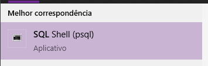
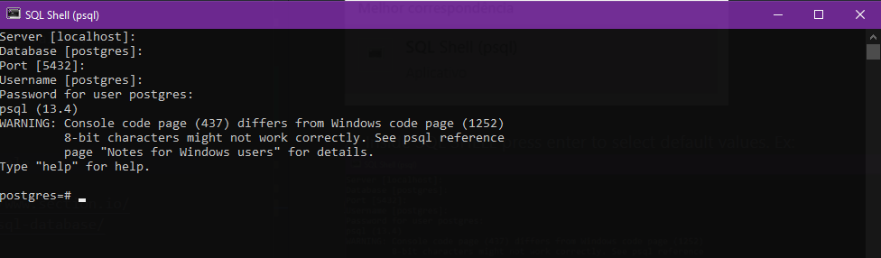

# Setup

## Dependencies
    * PostgreSQL
    * django
    * django-environ
    * psycopg2 ( https://www.psycopg.org/ )
    * pipenv
    * gevent
## Steps
1. create folder

### Clone repository
1. go to https://gitlab.com/jrnp97/ssp.git , and do a fork

    1.1. git clone <your_repository>

    1.2. git remote add upstream https://gitlab.com/jrnp97/ssp.git

    1.3. Check if when you run "git remote" >>> origin, upstream

### Install dependecies
1. Install pipenv: pip install pipenv

    1.1. Go to directory have pipFile and pipLock run: pipenv install

### Intall postgreSQL
1. https://www.postgresql.org/download/

2. Execute and install file.

### Username and passowrd default
* Username(default) = **postgres** 

* password = **(Installation passowrd)**

### Create Database
1. Search and open the PostgreSQL shell Ex: 

2. Inside SQL Shell press enter to select default values. Ex: 

    2.1. Password for user postgres: **(Your password configured in installation process postgreSQL)**

3. Run: CREATE DATABASE ssp;

#### configure django project
* Insert that datas in .env as in the .env.example

### Environ
1. Go to same directory the manage.py and Create file ".env"
2. Copy contenent the file .env.example to .env

follow instructions in .env.example and insert datas in .env created

Defaults datas
* HOST_DB = localhost
* PORT_DB = 5432

. in case of doubt, consult this site: https://django.environ.readthedocs.io/en/latest/

### Django Secret Key
1. Copy secret key in: https://djecrety.ir/
2. Paste secret key in SECRET_KEY .env

### Run test
1. go to cd ssp/ssp
2. run: `python manage.py migrate`
3. run: `python manage.py runserver`

Ref:
. in case of doubt, consult this site: https://www.section.io/engineering-education/django-app-using-postgresql-database/
